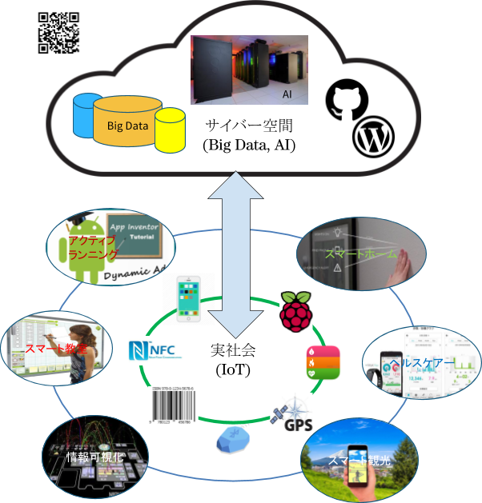

# Ubiquitous Information System lab.
# ユビキタス情報システム研究室

# Research
何時でも何処でも誰もが容易に利用できるユビキタス情報システム・サービスを創ることを目標としています。

* 学習管理システム：何時でも何処でも学習したいと思った時環境を提供
* 教育支援システム：学年歴図書館などキャンパス情報何時でもアクセス
* 観光情報システム：その時その場で必要な観光情報を即座に映し出す

実空間と仮想空間と融合、さりげなく利用者を支え

# Projects

## App and Cloud
1. [Classroom attendance App and Cloud](./SmartClassroom)
1. [Bookshelf App and Cloud](./SmartLibrary)
1. [Traveler App and Cloud](./SmartTravel)

## IoT and Cloud
1. [Ubiquitous Home](./SmartHome)
1. [EKG App and Cloud](./SmartHealth)

## Information System
1. [Classroom account and file share](./SmartCloud)
1. [Google Classroom API Application](./SmartLearning)

# Supervisor
* [Hong Chen](https://chen420.github.io/)

# Members
* [Members](./Members.md)

# Knowledge base
* [Lubuntu](./lubuntu.md)
* [App inventor](./ai2.md)
* [WordPress](./wp.md)
* [Processing](./Processing.md)

# Web sites
* [http://chenlab.net](http://chenlab.net)
* [http://daiichi-koudai.com](http://daiichi-koudai.com)

# Related Pages
* [https://uislab.github.io](https://uislab.github.io)
* [https://ubiclub.github.io](https://ubiclub.github.io)
* [https://edu2web.github.io](https://edu2web.github.io)
* [https://gitbook.com](https://gitbook.com)
